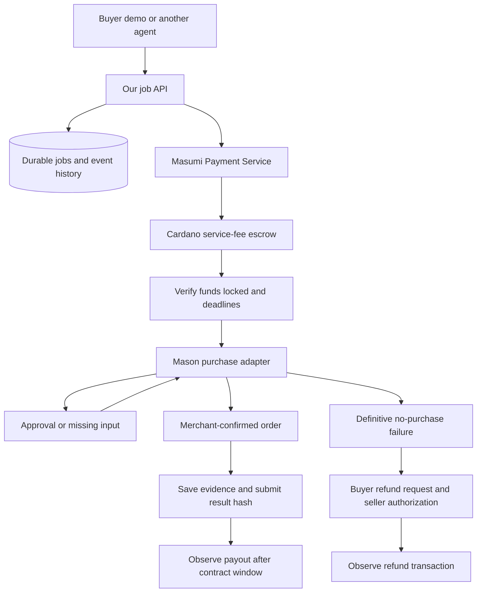

# Cardano Card — Ezra's integration plan

Updated 6 October 2026, Singapore time. See ../BUILD_STATUS.md for current implementation and acceptance limits. The integration lives under `masumi/` in `masonarditi/cardanocard`; run its commands from that directory. Runtime remains local and sandbox-only; no deployment, wallet payment or merchant order has been performed.

## Product and financial boundary

Another agent hires our purchasing service. It gives an intent, maximum merchant spend, and US delivery details. Masumi handles discovery and the service-fee escrow. Mason's AgentCard implementation pays the merchant using the authorized card and returns order evidence.

The buyer's escrow service fee and merchant spending budget are different assets/amounts. Do not infer a USD exchange rate from an ADA test fee. The first paid-agent registration should use a fixed, nonzero fee supported by the selected Preprod service. Price in test ADA for the first direct demo if available; use the precise supported test stablecoin only when registry/marketplace support is verified. Public guides currently disagree on test stablecoin details.

## What we need, top down

| Layer | Required inputs / deliverable | Owner | Current state |
|---|---|---|---|
| Scope | One merchant, one cardholder, one US address, order-confirmed success definition | Both | Defined; merchant/provider details pending |
| Masumi service | Local Payment Service + PostgreSQL + Blockfrost Preprod key | Ezra | Compose and private local credentials prepared; Blockfrost key missing |
| Wallets | Purchasing, selling, collection destination; test funds and fee buffers | Ezra | Not created/funded |
| Agent registration | Reachable API, capability metadata, examples, price/unit, agent ID, seller vkey | Ezra | Pending; local-only server for now |
| Job API | Start/status/schema/availability/input continuation | Ezra | Local scaffold implemented |
| Durable coordinator | Request deduplication, payment gate, deadlines, recovery, immutable inputs | Ezra | Implemented and locally tested |
| Merchant adapter | Durable bridge around Mason API client; continuation + read-only inspection | Both | Built and tested with synthetic responses; network mappings/acceptance pending |
| Settlement | Submit exact result hash, observe result confirmation and payout | Ezra | Simulated; V1 SDK adapter unverified |
| Refund | Buyer requests, seller authorizes, verify refund withdrawal | Ezra | Simulated; live path pending |
| Buyer client | Discover/select agent, request job, pay, poll, respond, verify evidence | Ezra | Simulation client + browser demo built; gated V1 buyer implemented, live acceptance pending |
| x402 | Decide protocol/version and prove one payment lock without double payment | Ezra | Separate compatibility spike, not implemented |
| Demo evidence | Testnet IDs/transactions, merchant order, failure/refund recording | Both | No live evidence yet |

The collection wallet is the destination for withdrawn earnings; unlike node-managed purchasing/selling wallets, configure its address without importing its signing seed into the service.

## Infrastructure choice

Try managed Masumi Preprod access first if its account supports all needed routes. Check create/resolve payment, submit-result, authorize-refund, create/resolve purchase, request-refund, and registry access. The managed application's API key/header/proxy paths are not automatically interchangeable with a raw Payment Node `token` key.

Current choice under the local-only instruction: use Masumi's documented Docker setup with a Blockfrost Preprod key and PostgreSQL. Docker Desktop is running. The Compose configuration has passed a syntax check; Payment Service/database containers are not yet started. See [local setup](LOCAL_MASUMI_SETUP.md). Hosted access remains an alternative only if scope changes.

Configuration inventory (no secrets in chat or version control):

- `PAYMENT_SERVICE_URL`, seller `PAYMENT_API_KEY`, `SELLER_VKEY`, `AGENT_IDENTIFIER`.
- Separate buyer service URL/key or explicitly scoped buyer source on the same node.
- Preprod purchasing/selling addresses, collection address, fee asset and amount in atomic units.
- Local node only: PostgreSQL URL, node encryption/admin keys, Blockfrost Preprod key.
- Later: stable public API URL, service storage, and a caller-to-cardholder authorization model.
- Mason's AgentCard secrets stay in his adapter configuration, not job payloads.

Registration needs a reachable endpoint; therefore live registration is deferred while everything must stay local. A local simulator does not establish registry discoverability.

## Version/API compatibility gate

Research inspected Python SDK commit `5a54f5e0755a1b7de52ae1823d767fe442b1ac13` (package source version 1.2.0). It emits `Web3CardanoV1`. The current x402 Cardano Masumi scheme explicitly requires `Web3CardanoV2`. Do not replace a constant and assume compatibility.

Before live integration, record the selected service version, OpenAPI, contract generation, auth header, request/response shapes, time units, hashing rules, asset identifiers, and timing minimums. Test the SDK with that service. Pin what works. If only V2 is supported, replace the adapter or choose the official V2 path; retain our provider-independent coordinator.

The official skill is useful but examples conflict with the SDK and newer API guide: input array vs object, field casing, result-hash composition, and status shapes. Treat the deployed service's OpenAPI plus observed Preprod transactions as acceptance evidence. The scaffold uses the pinned SDK's hash helpers only in its optional adapter; local hashes are labelled simulated.

Native MIP-003 hiring and x402 are different entry points. We must not collect a native service-fee payment and an x402 payment for the same job. For x402, bind the signed request terms, escrow identifier, confirmed transaction, and our job to a single record. That route remains unimplemented and must not be claimed in the pitch until proven.

## Job and payment state

Persist: server job UUID, buyer request ID, exact wire input, normalized purchase input, service identity, payment identifier, all deadlines, purchase status/references, approval revision, exact serialized result, observed escrow state, and event log. Live work also needs chain transaction IDs, expected/observed hashes, fee asset/amount, and buyer identity binding.

| Situation | Behavior |
|---|---|
| Unfunded or invalid funds | Never invoke purchasing |
| Funds locked with time remaining | Checkpoint and invoke one purchase ID |
| Approval/input pending | Persist prompt; accept only a matching job/schema revision |
| Processing/unknown/connection loss | Inspect existing purchase, never blindly create another |
| Confirmed order | Persist evidence before submitting the exact result hash |
| Result submission timeout | Keep order evidence; reconcile escrow, do not buy again |
| Definitive no-purchase failure | Wait for buyer refund request; authorize and observe refund |
| Refund overlaps uncertain/confirmed order | Operator review, no automatic no-purchase assertion |
| No time to begin safely | Do not start checkout; arrange permitted fee refund |
| Restart mid-purchase | Inspect saved purchase ID before further writes |
| Payout/refund window | Track actual on-chain withdrawal separately from API acceptance |

Money and purchase actions are serialized in this first implementation. SQLite supports one service instance; a process lock rejects a second worker. Durable database state does not make arbitrary provider actions exactly-once: Mason must enforce provider-level deduplication and reconciliation.

## Coding milestones and proof

1. **Local contract/core — done:** validation, fake providers, durable jobs, HTTP routes, buyer simulator, tests. No external credentials required.
2. **Compatibility + environment:** establish supported SDK/node/contract pair, Preprod service access, wallets and funding. Proof: authenticated read-only health and wallet views, then a deliberate tiny test job.
3. **Native escrow success:** registered paid agent + live buyer payment, fake purchase, result hash and withdrawal evidence. Clearly label the purchase as simulated.
4. **Native escrow failure/refund:** fake decline, buyer request, seller authorization, refund withdrawal evidence. Prove funds moved, not just an HTTP 200.
5. **Mason integration:** agree continuation/inspect methods; sandbox decline, budget rejection, approval loop, pending/unknown, retry/restart tests. Enable real adapter only after these pass.
6. **Sandbox acceptance:** use Mason’s already-linked sandbox handoff to prove sandbox_mode → refund. Use clearly labelled fake success for payouts. Production merchant purchases are outside the current scope.
7. **x402 decision/proof:** if included for track positioning, run an actual compatible lock into the same job lifecycle, with no double payment.
8. **Judge package:** runnable prepared demo, complete transaction evidence, clear mock/testnet/real labels, README/write-up and maximum-three-minute recording. Record slow settlement beforehand rather than pretending it completes instantly.

## Remaining implementation work

- Live buyer acceptance and registry discovery; V1 buyer code is implemented.
- Selected-node compatibility fixtures, exact hash verification, transaction evidence, and deadline policies.
- MIP-003 conformance/client tests, signed input acknowledgements as required by target clients.
- Caller/customer authorization before exposure; currently one private demo token represents one caller/cardholder.
- Bounded provider I/O and independent reconciliation workers; current single-worker prototype serializes jobs.
- Operator recovery for ambiguous create/submit/refund writes; no automatic retry of uncertain side effects.
- Persistent approval transport with Mason, cancellation verification, and live merchant support.
- Hosted deployment and x402 only after separately agreed scope.

## Sources reviewed

- [Official Masumi skill index](https://www.masumi.network/skill.md)
- [Full Masumi skill](https://github.com/masumi-network/masumi-skills/blob/main/skill/SKILL.md)
- [Python SDK source](https://github.com/masumi-network/pip-masumi/tree/5a54f5e0755a1b7de52ae1823d767fe442b1ac13)
- [Agent API](https://www.masumi.network/dev/masumi/documentation/technical-documentation/agentic-service-api)
- [Persistence/recovery](https://www.masumi.network/dev/masumi/documentation/technical-documentation/agent-state-persistence)
- [Managed service](https://www.masumi.network/dev/masumi/documentation/get-started/masumi-as-a-service)
- [Node setup](https://www.masumi.network/dev/masumi/documentation/get-started/install-masumi-node)
- [Registration](https://www.masumi.network/dev/masumi/documentation/get-started/register-agent)
- [Cardano x402 scheme](https://github.com/x402-foundation/x402/blob/main/specs/schemes/exact/scheme_exact_cardano.md)
